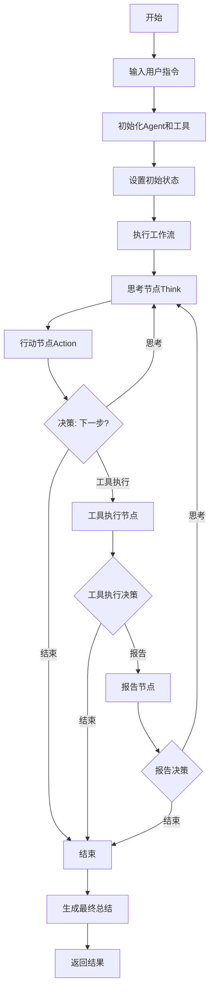
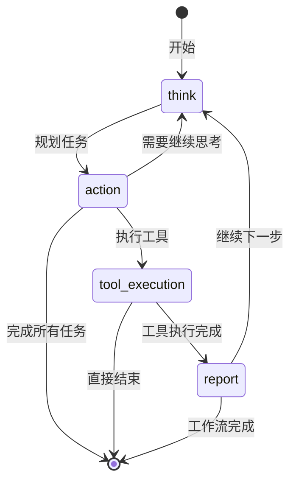
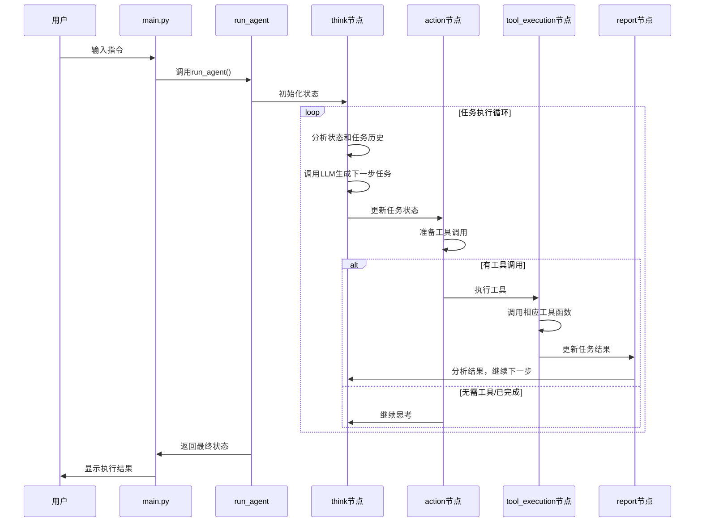
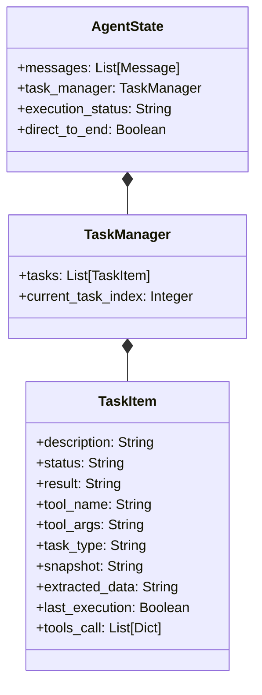

# 智能浏览器自动化助手

一个基于LangGraph的智能浏览器自动化系统，通过大语言模型规划和执行浏览器操作，解决用户复杂任务。

## 项目结构

- `main.py`: 主入口文件，处理用户输入并运行agent
- `graph.py`: 核心工作流定义，包含工作流节点和状态转换逻辑

## 执行逻辑流程

## 详细工作流状态转换

## 任务执行流程

## 状态对象结构

## 使用方法

1. 确保MCP服务正在运行:`npx @playwright/mcp@latest --port 8931`
2. 运行主程序：`uv run main.py`
3. 输入指令，系统将自动规划和执行任务
4. 查看执行结果

## 示例指令
- 打开百度搜索谷歌A2A协议文章，选择最相关的2篇文章进行总结